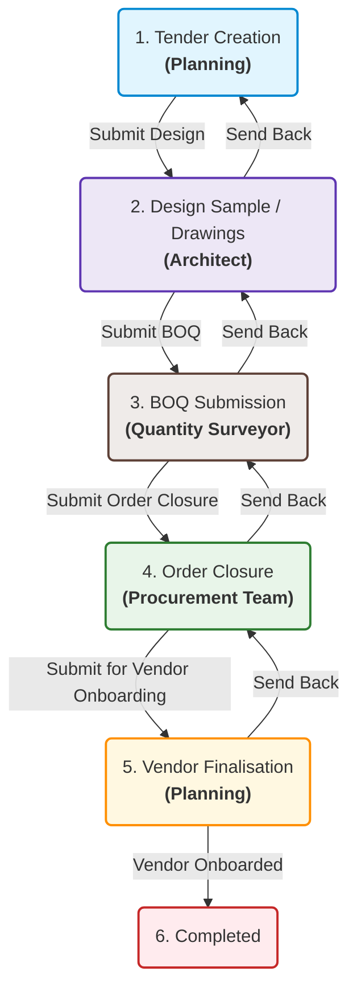

# Tender DocType Process Flow & Workflow Documentation

This document describes the complete lifecycle, process flow, date calculations, and role-based visibility matrix of the **Tender** doctype in the `realapp` application.

---

## 1. Process Lifecycle & Workflow States

The Tender document progresses through **6 sequential stages** managed by the **Tender Calendar Final WF** workflow. The transitions are governed by specific user roles.

---

## 2. Role-Based Visibility & Edit Matrix

Access control is configured dynamically in the frontend to support a downstream-read/upstream-write sequence:

| Stage (Tab) | Planning | Architect | Quantity Surveyor | Procurement Team |
| :--- | :---: | :---: | :---: | :---: |
| **Tab 1: Initiation** | **Edit** | Read-Only | Read-Only | Read-Only |
| **Tab 2: Schematic** | Remarks (RO) | **Edit** | Read-Only | Hidden |
| **Tab 3: BOQ** | Hidden | Remarks (RO) | **Edit** | Read-Only |
| **Tab 4: Order Closure** | Hidden | Hidden | Remarks (RO) | **Edit** |
| **Tab 5: Onboarding** | **Edit** | Hidden | Hidden | Remarks (RO) |

> [!NOTE]
> **Remarks (RO)** indicates that when a downstream user triggers a **Send Back** action, the targeted upstream user is granted read-only visibility *only* to the send-back remarks field of the tab that returned it.

---

## 3. Chaining & Calculation Mechanics

Target dates, revised dates, and timeline statuses are computed automatically using a business-days calendar (Saturdays are working days; Sundays are skipped).

### A. Target Date Chaining
Each stage has a baseline duration (`days_planned`) and inherits its initiation date from the submission of the previous stage:
1. **Schematic Target**: `initiated_date + no_of_days_planned`
2. **BOQ Target**: `Schematic Target + boq_submission_days_planned`
3. **Vendor Evaluation Target**: `BOQ Target + introduction_meet_days_planned`
4. **Floating Enquiries Target**: `Vendor Evaluation Target + floating_enquiries_days_planned`
5. **Pre-Bid Target**: `Floating Enquiries Target + pre_bid_no_of_days_planned`
6. **Negotiations 1 Target**: `Pre-Bid Target + quotation_1_days_planned`
7. **Negotiations 2 Target**: `Negotiations 1 Target + quotation_2_days_planned`
8. **Order Approval Target**: `Negotiations 2 Target + order_approval_days_planned`
9. **Agreement Target**: `Order Approval Target + agreement_no_of_days_planned`
10. **Introduction Meet Target**: `Agreement Target + introduction_meeting_days_planned`
11. **Mobilization Target**: `Introduction Meet Target + mobilization_days_planned`
12. **Vendor Mobilization Target**: `Introduction Meet Target + vendor_days_planned`

### B. Revised Planned Dates
Revised dates are only generated if the actual initiation exceeds the baseline target:
* **Rule**: If `work_initiation > target_date`, then:
  $$\text{Revised Date} = \text{work\_initiation} + \text{days\_planned} \text{ (excluding Sundays)}$$
* **Rule**: If `work_initiation <= target_date` (or is empty), the revised date remains **blank**.

### C. Timeline Status (Duration Left)
The timeline status always measures delays relative to the **original target date**:
* **Rule**:
  $$\text{Difference} = \text{original\_target\_date} - \text{comparison\_date}$$
  *(where comparison date is `work_initiation` if set, otherwise `today`)*
* **Status Strings**:
  * Difference $> 0$: `"X days left"`
  * Difference $= 0$: `"Due today"`
  * Difference $< 0$: `"X days delayed"`

---

## 4. Send-Back Dialogue & Revision Status

When a transition action is rejected via the **Send Back** action:
1. A dialog prompts the user to enter Remarks.
2. The remarks are stored in the target tab's send-back remarks field (e.g. `boq_send_back_remarks`).
3. The revision status of the **target tab** (e.g. `boq_revision_status`) is incremented by one level (e.g., `R0` ➔ `R1`).
4. **Single-Increment Protection**: Increment logic runs strictly on the backend (`tender.py`) on transition validate to prevent client-server double-increments.

---

## 5. Attachment Progression Flow

To ensure structured document collection, attachment fields are shown sequentially:
* **Schematic Readiness**: `schematic_attachment_1` to `schematic_attachment_8`
* **BOQ Submission**: `boq_attachment_1` to `boq_attachment_6`
* **Order Closure**: `negotiation_1__attachment_1` to `negotiation_1__attachment_3`, `negotiation_2_attachment_1` to `negotiation_2_attachment_3`, `order_approval_attachment_1` to `order_approval_attachment_2`, and `order_issue_attachment_1` to `order_issue_attachment_2`.

### Progression Rule
Field $N$ (for $N > 1$) is visible *only* if field $N-1$ is filled:
`depends_on: "eval:doc.attachment_field_prev"`

> [!IMPORTANT]
> To prevent workflow lockouts, **no attachment fields are mandatory** (`reqd: 0` and no `mandatory_depends_on`).
